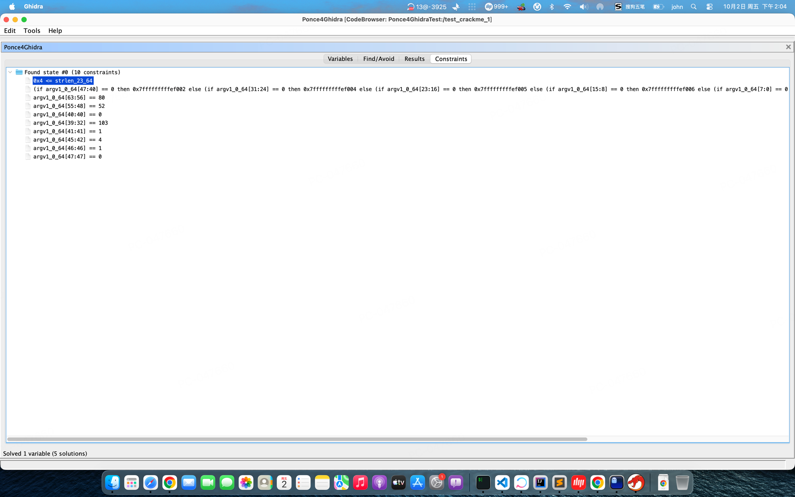
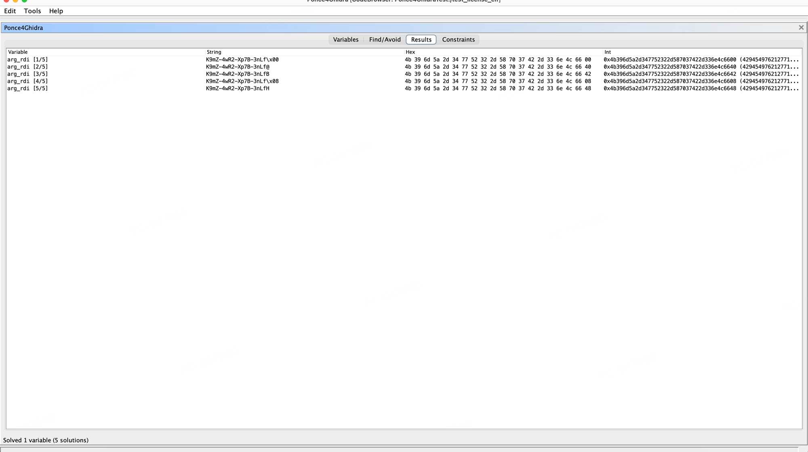

[English](README.md) | [中文](README_CN.md)

# Ponce4Ghidra

基于 [angr](https://angr.io) + [Z3](https://github.com/Z3Prover/z3) 的 Ghidra 交互式符号执行插件。

在反汇编视图中右键选择地址，符号化输入，点击求解——插件会自动找到让程序到达目标地址的具体输入值。密码破解、License Key 还原、CTF Flag 求解、加密参数提取——只要能转化为约束满足问题，Ponce4Ghidra 都能解。

**[项目主页](https://overkazaf.github.io/Ponce4Ghidra/index_cn.html)** — 架构图、工作流程、SAT/SMT 原理介绍。

## 快速演示

```
1. 在 Ghidra 中打开 test_crackme
2. 右键 0x1000004d7 (return 1) → Set as Find Target
3. 右键 0x100000484 (return 0) → Set as Avoid
4. Ponce4Ghidra → Symbolize argv[1] (size: 4)
5. Ponce4Ghidra → Solve Constraints
   → 求解结果: argv1 = P4Rg
```

### 约束面板 — 查看求解器如何推导出密码



每条约束对应密码的一个字节：`byte0 == 80 ('P')`、`byte1 == 52 ('4')`、`byte2 ^ 0x42 == 0x10 ('R')`、`byte3 + 0x20 == 0x87 ('g')`。

### 结果面板 — ELF 二进制的 5 个 license key 解



对 `test_license_elf` 的多解枚举：求解器找到了 5 个有效的 license key，都是 `K9mZ-4wR2-Xp7B-3nLf` 的变体，最后一个字节不同。

## 功能特性

**核心功能**
- 符号化命令行参数（argv）、函数参数、寄存器或内存区域
- 在 Listing 或 Decompiler 视图中右键设置 Find/Avoid 目标
- 每个变量最多返回 5 个不同的解
- 探索过程中状态栏实时显示进度

**分析能力**
- 约束面板（Constraints tab）— 查看求解器收集的所有约束条件
- Veritesting — 循环边界智能路径合并（默认开启）
- Unicorn 快速具体执行（安装后自动启用）
- 基于 angr Timeout 技术的超时保护

**平台支持**
- Mach-O (macOS x86_64) — 完整测试
- ELF (Linux x86_64) — 已测试静态链接二进制
- Android .so (ARM/ARM64) — 支持无入口点的共享库（延迟 state 创建）
- ARM32、MIPS32/64 寄存器支持

**用户体验**
- 8 个操作均配有彩色工具栏图标
- 内置快速入门指南，含 SAT/SMT 原理说明（Help 菜单）
- 会话持久化 — 跨 Ghidra 重启保存/恢复
- 求解前预检（未符号化时提前拦截，不浪费探索时间）
- 过期引擎检测（防止意外清空符号化变量）

## 工作原理


> **不是暴力破解** — 16 字节输入有 2¹²⁸ 种可能。约束条件将其化简为一个 Z3 能在秒级求解的方程组。

## 系统架构

```
┌─────────────┐    JSON/TCP    ┌──────────────────┐
│   Ghidra    │ ◄────────────► │   angr Engine    │
│   Plugin    │    port 13370  │   (Python)       │
│   (Java)    │                │                  │
│             │  commands:     │  angr.Project    │
│  Panel:     │  init          │  SimState        │
│  Variables  │  symbolize_*   │  SimulationMgr   │
│  Find/Avoid │  set_find/avoid│  explore()       │
│  Results    │  explore       │  solver.eval()   │
│  Constraints│  solve         │                  │
│             │  get_state     │  Z3 SMT Solver   │
│  Actions:   │  get_constraints                  │
│  8 menu     │  replay        │  Veritesting     │
│  items      │  set_options   │  Unicorn (opt)   │
└─────────────┘                └──────────────────┘
```

## 何时使用哪种符号化方式

| 方式 | 适用场景 |
|------|----------|
| **Symbolize argv[N]** | 程序从命令行读取输入，二进制较小且简单 |
| **Symbolize Function Argument** | 已知哪个函数负责校验输入，二进制较大/复杂，分析 .so 库。**建议首选。** |
| **Symbolize Register** | 未知量是标量（int/long），而非缓冲区 |
| **Symbolize Memory** | 未知量位于已知的固定内存地址 |

**经验法则**：优先使用 Function Argument（更快、更精准）。只有在需要完整程序执行上下文时才使用 argv。

## 安装

### 前置条件

- [Ghidra](https://ghidra-sre.org/) 11.4+
- Java 17+ (JDK)
- Python 3.10+，并在虚拟环境中安装 angr

### 安装步骤

```bash
# 1. 创建 Python 虚拟环境并安装 angr
python3 -m venv .venv
source .venv/bin/activate
pip install angr

# 可选：安装 unicorn 加速具体执行
pip install unicorn

# 2. 构建 Ghidra 扩展
export GHIDRA_INSTALL_DIR=/path/to/ghidra_11.4.3_PUBLIC
gradle buildExtension

# 3. 在 Ghidra 中安装
# Ghidra → File → Install Extensions → Add → 选择 dist/*.zip
# 或手动解压到 ~/Library/ghidra/.../Extensions/
```

### 运行方式

**方式 A** — 让插件自动管理引擎：
直接使用插件即可，它会在需要时自动启动引擎进程。

**方式 B** — 手动启动引擎（开发调试用）：
```bash
cd Ponce4Ghidra
PYTHONPATH=python python3 -m ponce4ghidra_engine -v
```
插件会连接到端口 13370 上已有的引擎。

## 测试套件

```bash
# 运行所有测试（会在 13371+ 端口启动引擎实例）
PYTHONPATH=python python3 test/test_engine.py
```

测试覆盖：
- angr 直接符号执行
- 服务器协议（init、symbolize、find/avoid、state）
- 未初始化命令防护
- Mach-O 导入函数 Hook
- 函数参数 + argv 符号化（Mach-O）
- 重初始化契约（防止过期引擎清空状态）
- 探索进度上报
- ELF 函数参数符号化

## 测试二进制

| 文件 | 格式 | 密码/Key | Find 地址 | Avoid 地址 |
|------|------|----------|-----------|-----------|
| `test_crackme` | Mach-O x86_64 | `P4Rg` | 0x1000004d7 | 0x100000484 |
| `test_license` | Mach-O x86_64 | `K9mZ-4wR2-Xp7B-3nLf` | 0x100000a38 | 0x100000a4f |
| `test_license_elf` | ELF x86_64 (static) | `K9mZ-4wR2-Xp7B-3nLf` | 0x1017327 | 0x101731e |

## 原理详解

Ponce4Ghidra 使用**符号执行**——不是暴力破解，也不是 fuzzing。

1. **符号变量**将具体输入替换为数学未知量
2. 每个分支产生一条**约束**：`if (input[0] == 'P')` → `byte0 == 0x50`
3. 分支的两侧被**同时探索**（路径分叉）
4. 当某条路径到达 Find 目标时，所有约束被发送给 **Z3**（SMT 求解器）
5. Z3 找到满足全部约束的具体值——就是密码

16 字节输入有 2¹²⁸ 种可能。约束条件将其化简为一个方程组，Z3 几秒内就能求解。

## 许可证

MIT
